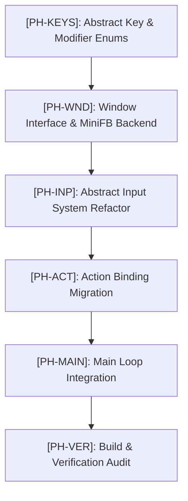
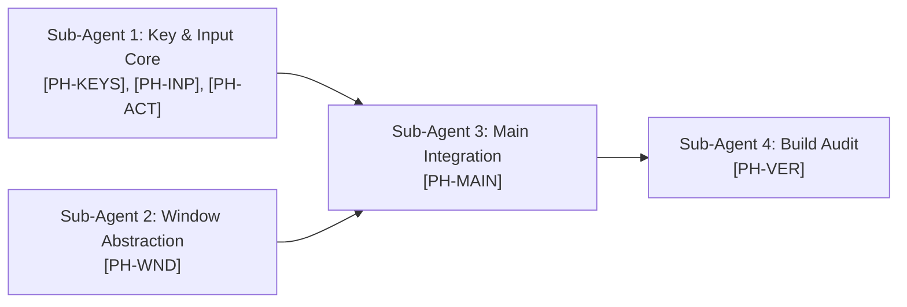

# `[EP-MFBA]`: MiniFB Decoupling & Windowing Abstraction Plan

> [!NOTE]
> This plan uses the **`targeted-cpp-refactoring`** skill framework and strictly enforces the **Dependency Inversion Principle (DIP)**. High-level engine components (`Game`, `SceneManager`, `Input`, `Action`) will depend on abstract interfaces (`IWindow`, `KeyCode`), completely encapsulating concrete `MiniFB` third-party library details inside backend source files (`MiniFBWindow.cpp`).

---

## 1. Executive Architectural Summary & Scope

Currently, `MiniFB` (`<MiniFB.h>`) is directly included in `src/core/GameWindow.h`, `src/core/Input.h`, `src/core/Input.cpp`, and referenced via `MFB_KB_KEY_*` constants in `src/alx/Action.h`, `src/alx/Action.cpp`, and `src/main.cpp`.

This refactoring completely isolates `MiniFB` behind a clean, framework-agnostic windowing and input interface. Replacing `MiniFB` in the future with another 2D windowing/rendering backend (e.g. SDL2, GLFW, Raylib, WebAssembly/Emscripten) will only require writing a new implementation of `IWindow` without modifying high-level game logic or input code.

### Target Files & Scope
- **`src/core/KeyCodes.h`** *(NEW)*: Abstract `KeyCode` and `KeyModifier` enum classes.
- **`src/core/IWindow.h`** *(NEW)*: Pure abstract interface for windowing, presentation, scaling, and event callbacks.
- **`src/core/MiniFBWindow.h`** *(NEW)*: Concrete `MiniFBWindow` declaration header (clean, no `<MiniFB.h>` included!).
- **`src/core/MiniFBWindow.cpp`** *(NEW)*: Concrete `MiniFBWindow` implementation (holds `struct mfb_window*` and includes `<MiniFB.h>`).
- **`src/core/GameWindow.h`** *(REFACTORED)*: Header declaration for high-level facade window.
- **`src/core/GameWindow.cpp`** *(NEW)*: Source implementation for `GameWindow` satisfying header/source separation.
- **`src/core/Input.h`** & **`src/core/Input.cpp`** *(REFACTORED)*: Framework-agnostic input manager using `KeyCode` and delegate callbacks.
- **`src/alx/Action.h`** & **`src/alx/Action.cpp`** *(REFACTORED)*: GBA hardware action bindings migrated to `KeyCode`.
- **`src/main.cpp`** *(REFACTORED)*: Main loop migrated to `IWindow` callbacks and abstract `KeyCode::Escape`.

---

## 2. Refactoring Standards & Applied Skill Patterns

1. **`[DIP]` Dependency Inversion Principle**: High-level game code (`main.cpp`, `Action`, `Input`) depends strictly on abstract contracts (`IWindow`, `KeyCode`, `KeyModifier`). Concrete `MiniFB` C-functions (`mfb_open_ex`, `mfb_update_ex`, `mfb_set_keyboard_callback`) are strictly quarantined inside `MiniFBWindow.cpp`.
2. **`[HSS]` Header vs. Source Separation**: Declarations in `.h` headers, implementations in `.cpp` source files. `GameWindow.h` inline implementation methods moved to `GameWindow.cpp`.
3. **`[PIMP]` Pimpl / Opaque Pointer Encapsulation**: Forward declare `struct mfb_window` in headers or encapsulate it inside implementation translation units to eliminate `#include <MiniFB.h>` leakage into the global header graph.
4. **`[ZMNM]` Zero Magic Numbers & Dynamic Sizing**: Presentation scaling, letterboxing offsets, and buffer allocation math isolated in `MiniFBWindow.cpp` using named constants and dynamic container bounds.
5. **`[CPP20]` Modern C++20 Enums & Value Semantics**: Strongly-typed `enum class KeyCode : uint16_t` and `enum class KeyModifier : uint8_t` eliminating parameter traps.

---

## 3. Acronym-Based Breakdown of Refactoring Phases

### `[PH-KEYS]`: Phase 1 - Abstract Key & Modifier Definitions
- `[KEYC]`: **Create `src/core/KeyCodes.h`**
  - Define `enum class KeyCode : uint16_t` with explicit key entries covering all keyboard keys used in the codebase (`W`, `A`, `S`, `D`, `Up`, `Down`, `Left`, `Right`, `J`, `K`, `Q`, `O`, `Z`, `X`, `Enter`, `Tab`, `Space`, `Escape`, `Key5`, `Key6`, `Equal`, `Minus`, etc.).
  - Define `enum class KeyModifier : uint8_t` (`None`, `Shift`, `Control`, `Alt`, `Super`).
  - Add helper functions `key_code_to_string()` for logging.

### `[PH-WND]`: Phase 2 - Window Interface (`IWindow`) & `MiniFB` Concrete Backend
- `[IWND]`: **Create `src/core/IWindow.h`**
  - Abstract interface defining window lifecycle methods (`is_running()`, `close()`, `is_active()`, `poll_events()`, `width()`, `height()`, `present()`).
  - Define callback delegates:
    - `using KeyCallback = std::function<void(KeyCode key, KeyModifier mod, bool is_pressed)>;`
    - `using ActiveCallback = std::function<void(bool is_active)>;`
  - Define callback setters (`set_key_callback()`, `set_active_callback()`).
- `[MFBW]`: **Create `src/core/MiniFBWindow.h` & `src/core/MiniFBWindow.cpp`**
  - Concrete class `MiniFBWindow` implementing `IWindow`.
  - Encapsulate `struct mfb_window* m_window;` in `MiniFBWindow.h` via forward declaration (`struct mfb_window;`).
  - `#include <MiniFB.h>` placed strictly inside `MiniFBWindow.cpp`.
  - Implement MiniFB callback static shims in `MiniFBWindow.cpp` that translate raw `mfb_key` to `KeyCode` and dispatch registered `KeyCallback` / `ActiveCallback` delegates.
  - Implement presentation logic (integer scaling, letterboxing/pillarbox centering) with `std::fill` and zero heap allocation in frame loop.
- `[GMFW]`: **Refactor `src/core/GameWindow.h` & Create `src/core/GameWindow.cpp`**
  - Refactor `GameWindow` to act as a high-level wrapper owning a `std::unique_ptr<IWindow>`.
  - Move method bodies from `GameWindow.h` into `GameWindow.cpp` (satisfying Header/Source separation).

### `[PH-INP]`: Phase 3 - Framework-Agnostic Input System Refactoring
- `[INPH]`: **Refactor `src/core/Input.h`**
  - Remove `#include <MiniFB.h>`. `#include "core/KeyCodes.h"`.
  - Replace `mfb_key` and `mfb_key_mod` with `KeyCode` and `KeyModifier`.
  - Update signatures:
    - `void update_input_state(bool is_window_active);`
    - `void keyboard_callback(KeyCode key, KeyModifier mod, bool is_pressed);`
    - `void window_active_callback(bool is_active);`
    - `bool is_modifier_held(KeyModifier modifier);`
- `[INPC]`: **Refactor `src/core/Input.cpp`**
  - Remove `#include <MiniFB.h>`.
  - Update `keyboard_callback` and `is_modifier_held` to use `KeyCode` and `KeyModifier`.
  - Retain full `minigamepad` functionality unchanged.

### `[PH-ACT]`: Phase 4 - GBA Action Hardware Binding Migration
- `[ACTH]`: **Refactor `src/alx/Action.h`**
  - Remove `#include "core/Input.h"` header dependency if unneeded; `#include "core/KeyCodes.h"`.
  - Update `GBA::DPAD_UP`, `BUTTON_A`, etc., to use `KeyCode::W`, `KeyCode::Up`, `KeyCode::J`, `KeyCode::Z`, etc.
  - Change dynamic binding parameter types from `int` to `KeyCode`.
- `[ACTC]`: **Refactor `src/alx/Action.cpp`**
  - Update debug key bindings (`DebugResource`, `DebugEnemyWave`, `DebugTwUp`, `DebugTwDown`) to use `KeyCode::Key5`, `KeyCode::Key6`, `KeyCode::Equal`, `KeyCode::Minus`.

### `[PH-MAIN]`: Phase 5 - Main Loop & Entry Point Integration
- `[MNIP]`: **Refactor `src/main.cpp`**
  - Update `frame_updates` to check `KeyCode::Escape` instead of `MFB_KB_KEY_ESCAPE`.
  - Wire input callbacks via abstract `IWindow` callback setters (`game_window.set_key_callback(Input::keyboard_callback);`, `game_window.set_active_callback(Input::window_active_callback);`).
  - Pass `game_window.is_active()` to `Input::update_input_state()`.

### `[PH-VER]`: Phase 6 - Build Verification & Leak Audit
- `[BVAL]`: **Execute `task build` Verification**
  - Run build task to confirm syntax validity and link integrity.
- `[LKAD]`: **Header Leak Audit**
  - Run grep search across `src/**/*` to verify that `#include <MiniFB.h>` exists ONLY inside `src/core/MiniFBWindow.cpp`.

---

## 4. Sub-Agent Work Distribution Plan

To execute this refactoring efficiently without context bloat or file collision, four specialized sub-agents will be dispatched sequentially and in parallel where safe:

### Sub-Agent 1: Key & Input Core Agent (`Agent-KeyInput`)
- **Assigned Tasks**: `[PH-KEYS]`, `[PH-INP]`, `[PH-ACT]`
- **Target Files**:
  - `src/core/KeyCodes.h` *(Create)*
  - `src/core/Input.h` & `src/core/Input.cpp` *(Refactor)*
  - `src/alx/Action.h` & `src/alx/Action.cpp` *(Refactor)*
- **Specific Output**: Abstract key enums created, input system refactored to use `KeyCode`, and GBA action hardware bindings migrated off `MFB_KB_KEY_*`.

### Sub-Agent 2: Window Abstraction & MiniFB Backend Agent (`Agent-WindowBackend`)
- **Assigned Tasks**: `[PH-WND]`
- **Target Files**:
  - `src/core/IWindow.h` *(Create)*
  - `src/core/MiniFBWindow.h` & `src/core/MiniFBWindow.cpp` *(Create)*
  - `src/core/GameWindow.h` & `src/core/GameWindow.cpp` *(Refactor & Create)*
- **Specific Output**: Abstract `IWindow` interface created; `MiniFB` encapsulated entirely within `MiniFBWindow.cpp`; `GameWindow` refactored to separate header declaration from source implementation.

### Sub-Agent 3: Main Integration Agent (`Agent-MainIntegration`)
- **Assigned Tasks**: `[PH-MAIN]`
- **Target Files**: `src/main.cpp`
- **Specific Output**: Wire up `IWindow` abstract callbacks and `KeyCode::Escape` in `main.cpp`.

### Sub-Agent 4: Verification & Header Leak Audit Agent (`Agent-BuildVerify`)
- **Assigned Tasks**: `[PH-VER]`
- **Target Scope**: Entire `src/**/*` codebase.
- **Specific Output**: Run `task build` and execute grep verification confirming `<MiniFB.h>` zero-leak rule.
