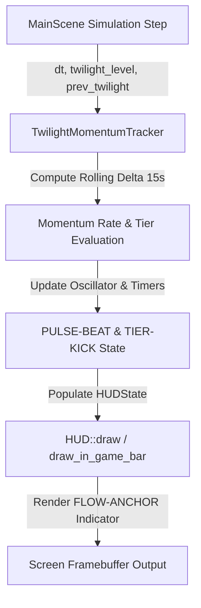

# Implementation Plan: [TWBAR] Twilight Momentum Barometer

## Goal Description
Implement **[TWBAR]**, an in-game HUD velocity and momentum indicator situated directly beneath the top Twilight percentage bar. The barometer computes a rolling 15-second delta of Twilight change to provide immediate peripheral feedback on whether **Light** (purification) or **Twilight** (corruption) is winning the room and at what rate, utilizing dynamic directional chevrons (`<<< [Light]` / `[◇]` / `[Twilight] >>>`), rate-driven pulse breathing, micro-kick offsets, and direction-flip snap flashes.

---

## User Review Required

> [!IMPORTANT]
> **Zero-Overhead Rolling Delta Tracker**: The rolling 15s delta calculation will be implemented as an independent, lightweight simulation component (`TwilightMomentumTracker`) that runs in both Debug and Release builds with zero heap allocations, fully separated from optional developer telemetry macros.

> [!NOTE]
> **Font Glyph Asset Reuse**: The barometer leverages existing 8x8 font glyphs (`\x0F` for Light Spark, `\x08` for Twilight Icon, `\x04` for Equilibrium Diamond, and `<`/`>` for directional flow chevrons) with pixel-accurate drop shadows, ensuring 100% GBA visual coherence with zero asset file bloat.

---

## Proposed Changes



---

### Component 1: Momentum Tracking & State Calculation

#### [NEW] `src/alx/TwilightMomentumTracker.h`
- Define `enum class MomentumTier : uint8_t`:
  - `HeavyLight`, `ModerateLight`, `SlightLight`, `Equilibrium`, `SlightTwilight`, `ModerateTwilight`, `HeavyTwilight`.
- Define `struct TwilightMomentumState`:
  - `float rolling_delta{0.0f}` (percentage change per 15-second window)
  - `MomentumTier current_tier{MomentumTier::Equilibrium}`
  - `MomentumTier previous_tier{MomentumTier::Equilibrium}`
  - `float pulse_phase{0.0f}` (sine oscillator for breathing & luminance)
  - `float kick_offset_x{0.0f}` (1-2px micro-nudge on tier shift)
  - `float kick_timer{0.0f}`
  - `float flash_timer{0.0f}` (snap-flash duration on direction flip)
  - `bool flash_is_light{false}`
- Define `class TwilightMomentumTracker`:
  - Fixed-size ring buffer of 60 time buckets (0.25s per bucket = 15.0s window).
  - Memory footprint: $< 500\text{ bytes}$, zero dynamic heap allocations.
  - `void reset(float initial_twilight);`
  - `void update(float dt, float current_twilight, float prev_twilight);`
  - `[[nodiscard]] const TwilightMomentumState& state() const noexcept;`

#### [NEW] `src/alx/TwilightMomentumTracker.cpp`
- Implement bucket accumulation and rolling window summation:
  $$\text{rate\_per\_sec} = \frac{\sum \Delta \text{twilight}}{\sum dt}, \quad \text{rolling\_delta} = \text{rate\_per\_sec} \times 15.0\text{s} \times 100.0\%$$
- Implement tier classification based on rate thresholds:
  - $\text{HeavyLight}: \text{delta} \le -5.0\%$
  - $\text{ModerateLight}: -5.0\% < \text{delta} \le -2.0\%$
  - $\text{SlightLight}: -2.0\% < \text{delta} \le -0.5\%$
  - $\text{Equilibrium}: -0.5\% < \text{delta} < +0.5\%$
  - $\text{SlightTwilight}: +0.5\% \le \text{delta} < +2.0\%$
  - $\text{ModerateTwilight}: +2.0\% \le \text{delta} < +5.0\%$
  - $\text{HeavyTwilight}: \text{delta} \ge +5.0\%$
- Implement pulse frequency mapping ($0.5\text{ Hz} \to 4.0\text{ Hz}$) and advance `pulse_phase`.
- Trigger `kick_timer` (0.05s) on tier changes and `flash_timer` (0.05s) on zero-crossings.

---

### Component 2: HUD Data Model & Rendering

#### [MODIFY] `src/alx/HUD.h`
- Include `alx/TwilightMomentumTracker.h`.
- Add `TwilightMomentumState momentum{}` to `HUDState`.
- Add visual palette constants to `namespace HUD`:
  - `COLOR_MOMENTUM_LIGHT_FLASH = 0xFFFFFFFF` (Pure Ice-White)
  - `COLOR_MOMENTUM_LIGHT_VIVID = 0xFF00E5FF` (Vivid Ice-Cyan)
  - `COLOR_MOMENTUM_LIGHT_MUTED = 0xFF40A8C0` (Muted Cyan)
  - `COLOR_MOMENTUM_EQUILIBRIUM  = 0xFF4A6B82` (Neutral Slate Teal)
  - `COLOR_MOMENTUM_TW_MUTED    = 0xFF7A4B9E` (Muted Violet)
  - `COLOR_MOMENTUM_TW_VIVID    = 0xFF9B30FF` (Dark Mana Violet)
  - `COLOR_MOMENTUM_TW_FLASH    = 0xFFD154FF` (Neon Magenta-Violet)
- Declare `void draw_momentum_barometer(const HUDState& state, int screen_width, int screen_height);`.

#### [MODIFY] `src/alx/HUD.cpp`
- Implement `draw_momentum_barometer`:
  - Position centered horizontally at `screen_width / 2 + kick_offset_x`, vertically at `bar_y + BAR_HEIGHT + 2`.
  - Determine active center glyph (`\x0F` for Light, `\x08` for Twilight, `\x04` for Equilibrium).
  - Determine chevron string based on tier (`<`, `<<`, `<<<` pointing Left for Light; `>`, `>>`, `>>>` pointing Right for Twilight; empty for Equilibrium).
  - Apply breathing chevron spacing and luminance sine modulation:
    $$\text{Luminance} = 1.0f + 0.25f \cdot \sin(\text{pulse\_phase})$$
  - Render with drop shadow using `Draw::text_shadow` on `Layer::HUD_Text`.
- Call `draw_momentum_barometer(state, screen_width, screen_height);` inside `draw_in_game_bar`.

---

### Component 3: MainScene Integration

#### [MODIFY] `src/alx/MainScene.h`
- Include `alx/TwilightMomentumTracker.h`.
- Add member `TwilightMomentumTracker m_momentum_tracker;`.

#### [MODIFY] `src/alx/MainScene.cpp`
- In `MainScene::reset` / constructor: initialize `m_momentum_tracker.reset(m_twilight_level)`.
- In `MainScene::update_twilight_metrics`: call `m_momentum_tracker.update(dt, m_twilight_level, prev_twilight)`.
- In `MainScene::draw_screen`: pass `m_momentum_tracker.state()` into `hud_state.momentum`.

---

## Verification Plan

### Automated Build Verification
```bash
task build
```
*Verify that compilation succeeds cleanly with zero warnings, zero link errors, and full C++20 standard compliance.*

### Manual Gameplay Verification
1. **Equilibrium Testing**: Launch game with `task run`; verify the indicator shows the steady slate diamond `[◇]` centered under the pill bar.
2. **Purification Testing**: Connect Dark Mana Spire network to convert twilight; verify indicator transitions `< [Light]` $\to$ `<< [Light]` $\to$ `<<< [Light]` with cyan/white pulse breathing and leftward kick bump.
3. **Corruption Testing**: Use debug twilight increase (`DebugTwUp`); verify indicator transitions `[Twilight] >` $\to$ `[Twilight] >>` $\to$ `[Twilight] >>>` with violet/magenta pulse and rightward kick bump.
4. **Transition Snap Flash**: Toggle balance back and forth; verify the 3-frame solid flash occurs smoothly upon crossing the zero line.
