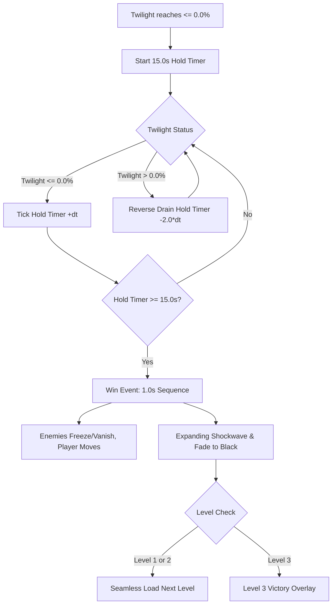

# [EP-LVWN]: Level Win & Climax Purification Mechanics

**Status**: Ready for Implementation
**Estimated Timeline**: 1.0 Day
**Related Epic**: `[LVCM]` (Level Clear / Victory Mechanics) in [plans/game_jam_priority_analysis.md](file:///Users/matt/code/cpp/alx/plans/game_jam_priority_analysis.md)

---

## 1. System Overview & Core Loop

---

## 2. Phased Task Breakdown

### [PH-MVPW]: Phase 1 - Core Hold Logic & Sub-Zero Buffer (Tier 1 MVP) (COMPLETED)
- [x] `[CLMT]`: Sub-Zero Twilight Cushion — Allow room twilight calculation to accumulate down to `-3.0%` internally while clamping the player-facing HUD value to `0.0%`.
- [x] `[HOLD]`: 15-Second Hold State Machine — Implement hold timer progression when Twilight $\le 0.0\%$, and apply a `2.0x` reverse drain penalty when Twilight $> 0.0\%$. Timer is clamped between `[0.0s, 15.0s]`.
- [x] `[CDUI]`: Space-Padded Top HUD Countdown — Render centered hold timer text inside the top dark pill (`HOLD: 15s` ... `HOLD:  9s` ... `HOLD:  3s`) with fixed character spacing to prevent horizontal text jitter.

### [PH-TRNS]: Phase 2 - Seamless Transitions & Level 3 Victory Screen (Tier 1 MVP) (COMPLETED)
- [x] `[ENTF]`: Win Event Trigger & Entity State — Upon hold timer reaching `15.0s`, lock enemy AI / freeze mob actions while maintaining player movement control during the 1.0s win sequence.
- [x] `[LVTR]`: Seamless Multi-Level Advance — For Level 1 and Level 2, trigger a smooth 0.5s fade-out &rarr; load next level layout &rarr; re-initialize network &rarr; 0.5s fade-in.
- [x] `[LV3E]`: Level 3 Victory Overlay Modal — For Level 3 completion, display a final victory modal banner with two selectable actions:
  - **"Play Again"**: Restarts the run / level.
  - **"Main Menu"**: Returns to the main title screen.

### [PH-FRNZ]: Phase 3 - Dark Tower Frenzy Mode (Tier 2 High Impact)
- [ ] `[FRNZ]`: Per-Level Spawn Interval Acceleration — Speed up Dark Tower spawn rate and enemy emergence during active hold:
  - **Level 1**: `+20%` spawn frequency.
  - **Level 2**: `+35%` spawn frequency.
  - **Level 3**: `+50%` spawn frequency.
- [ ] `[FRNV]`: Frenzy Visual Tint — Apply a subtle red pulse/tint effect to active Dark Towers and mobs while the hold countdown is active.

### [PH-FXAU]: Phase 4 - Shockwave Visuals & Audio Feedback (Tier 2 High Impact)
- [ ] `[RSCH]`: Rasterizer Ring Research — Inspect software rendering capabilities in `src/engine/` to evaluate feasibility of a hollow circle / ring mask.
- [ ] `[FLSH]`: Room Shockwave Expansion — Expand a radial light ring outward from the room/map center across the viewport over 1.0s. If ring rasterization is cost-prohibitive, fall back to a full-screen white-hot flash.
- [ ] `[SFXT]`: Hold Countdown SFX Ticking — Play a soft, non-intrusive low/medium metronome audio click on each whole second countdown tick.
- [ ] `[SFXW]`: Triumphant Victory Chime — Play a bright GBA-style victory chime SFX when the hold timer hits 0s.

### [PH-PLSH]: Phase 5 - Optional Stretch Polish (Tier 3 Nice-to-Have)
- [ ] `[SPRP]`: Spire Resonance Pulse — Trigger synchronized concentric light pulses around active Spires as they refine during the hold.
- [ ] `[STAT]`: Final Victory Stats — Optionally display clear time and alloy collected on the Level 3 victory overlay.
